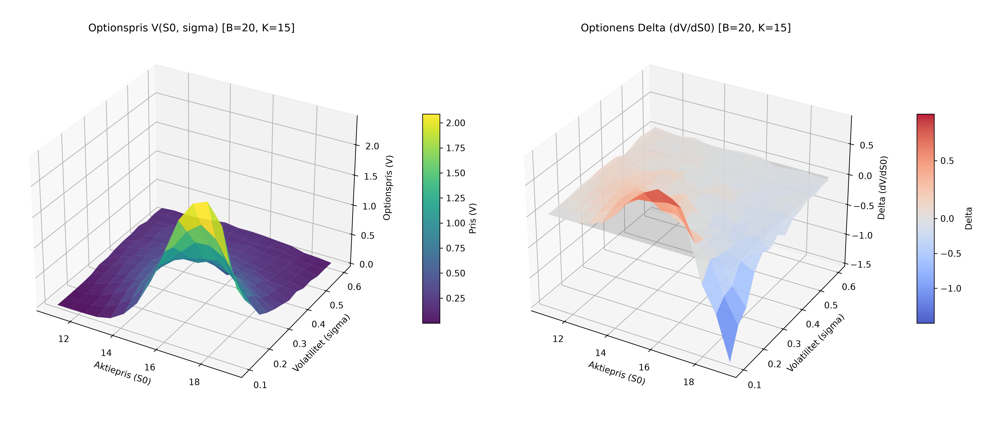

# Monte Carlo Pricing of Barrier Options (`price_barrier_mc`)

Monte Carlo simulation framework for pricing Up-and-Out European Barrier Call options and computing option sensitivities (Delta $\Delta$) across various underlying asset prices ($S_0$) and volatilities ($\sigma$).

## Overview

A barrier option is a path-dependent exotic derivative whose payoff depends on whether the underlying asset price reaches a specified barrier level $B$ during the option's lifetime.

This repository implements:
- **Up-and-Out Call Option Valuation**: Simulates underlying asset price paths using geometric/CEV-type stochastic differential equations with Euler-Maruyama discretization.
- **Finite Difference Delta Estimation**: Approximates Delta ($\Delta = \frac{\partial V}{\partial S}$) via central finite differences.
- **3D Surface Visualizations**: Analyzes the joint impact of spot price $S_0$ and volatility $\sigma$ on both the option price surface and delta surface.

## Parameters

- **$S_0$ (Initial Asset Price)**: e.g. $14
- **$K$ (Strike Price)**: $15
- **$B$ (Barrier Level)**: $20 (or varied)
- **$r$ (Risk-free Rate)**: $0.05$ (5%)
- **$T$ (Time to Maturity)**: $0.5$ years
- **$\sigma$ (Volatility)**: $0.1$ – $0.6$
- **$\gamma$ (Elasticity)**: $1.0$ (standard Geometric Brownian Motion)

## Visualization

The script generates 3D visualizations showing the option price and delta surfaces:



## Usage

Ensure you have Python installed with `numpy` and `matplotlib`:

```bash
pip install numpy matplotlib
```

Run the simulation:

```bash
python Assigment4.py
```
